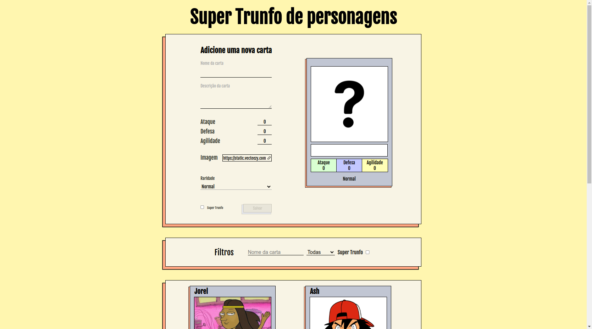

># Super Trunfo Game

## Projeto completo!

## Sobre o projeto
        Esse projeto foi desenvolvido a fim de exercitar meus conhecimentos em React, fazendo um
        formulário utilizando das mais novas tecnologias do JSX. Definindo estados, atualizando
        estados, passando props de pai para filho e atualizando estados do componente pai 
        diretamente do componente filho através de callback.
        O aplicativo consiste em um baralho de cartas do antigo jogo Super Trunfo. No aplicativo
        já vem com algumas cartas configuradas mas o usuário pode adicionar novas cartas se assim
        ele preferir.

># 🔗 [Acesse clicando aqui!](https://luandersonalvesdev.github.io/super-trunfo-game)

## 👨‍💻 APRENDIZADO
- Criação de formulário usando React.
- Manipulação de estados no React.
- Uso de props.
- Manipulação do React DOM.
- Capturar eventos usando JSX.
- Atualizar o estado de um component.
- Transmitir informações de componentes filhos para componentes pais via callbacks.

## 🛠️ FERRAMENTAS USADAS 
- React
- React DOM
- JSX

## CONTATO

https://linkedin.com/in/luandersonalvesdev